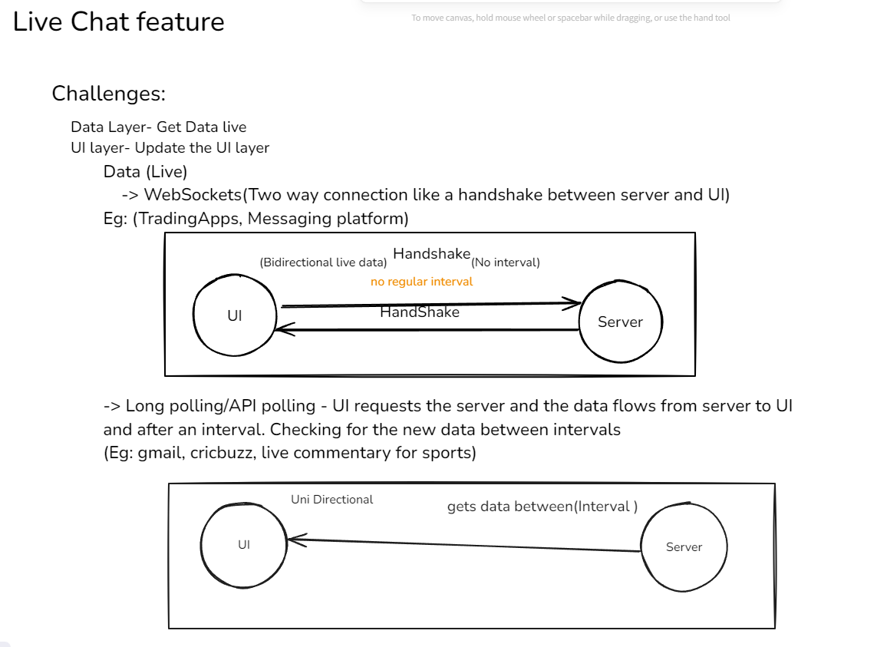

# Machine coding

- Higher order components : A component which takes one component and returns the other component.
  (TAKES EXISTING AND MODIFIES IT A LITTLE)

## Interview question

- Build a search bar - Debouncing : When you are typing very fast it skips some events
  typing slow = 200ms
  typing fast = 30ms
  It is useless to call API for every key stroke
  Performance - iphone 16 pro max = 14letters(each api call) _ 1000 users = 14,000 API calls - with debouncing = 3 API calls _ 1000 = 3,000 API calls
  Debouncing with 200ms - If the diff. between two key strokes is less than 200ms then decline the API call - If greater than 200ms

### Cache

Time complexity for tro search in array : O(n)
Time complexity for tro search in object : O(1)
new Map();

[i, ip, iph, iphone] O(n)
{
i:
ip:
iph:
ipho:
}

- Used map data structure to store the searchQuery in cache to avoid redudant API calls (search opitmization)
- Built nested comments feature using mock data and recursion

- Built live chat with mock data by adding a poll time of 2 secs

- Added an input to send our text in live chat
- Live Chat >>> Infinite scroll >>> pagination
- Splicing comments from older ones if they exceed particular OFF_SET size

